# E-Commerce Back-End
An application that builds the back-end for an e-commerce site using a working Express.js API and configuring it to use Sequelize to interact with a MySQL database.

## Description


### User Story

```md
AS A manager at an internet retail company
I WANT a back end for my e-commerce website that uses the latest technologies
SO THAT my company can compete with other e-commerce companies
```

### Acceptance Criteria


```md
GIVEN a functional Express.js API
WHEN I add my database name, MySQL username, and MySQL password to an environment variable file
THEN I am able to connect to a database using Sequelize
WHEN I enter schema and seed commands
THEN a development database is created and is seeded with test data
WHEN I enter the command to invoke the application
THEN my server is started and the Sequelize models are synced to the MySQL database
WHEN I open API GET routes in Insomnia for categories, products, or tags
THEN the data for each of these routes is displayed in a formatted JSON
WHEN I test API POST, PUT, and DELETE routes in Insomnia
THEN I am able to successfully create, update, and delete data in my database
```

### What I Learned
- Further reinforcement of setting up Node.js environments and running a server 
- Linking an API to a database to perform CRUD operations and handle requests on a server
- Using Sequelize methods to build models and create data for our database tables
- Continued use of Insomnia to test API routes for our application


## Table of Contents

- [Built Using](#built-using)
- [Installation](#installation)
- [Usage](#usage)
- [Walkthrough](#walkthrough)
- [License](#license)
- [Questions](#questions)
- [Socials](#socials)


## Built Using
      


## Installation


- To test locally, you can clone this repo to your device and test in your own code editor and terminal. 
Please make sure Node.js has been installed. In your terminal/command line, run `npm i` or `npm install` to install the Node dependencies found in the `package.json` file.

- The following Development dependencies will be downloaded after the install are:  
   1. MySQL2
        - https://www.npmjs.com/package/mysql2
   2. Express.js
        - https://expressjs.com/
   3. Sequelize
        - https://sequelize.org/
   4. Dotenv
        - https://www.npmjs.com/package/dotenv
   5. Nodemon
        - https://www.npmjs.com/package/nodemon

   


## Usage  

1. We first need to login and connect to our database. We'll do this by logging in to to our MySQL and should see the following message in our terminal where we're then prompted to enter our password.

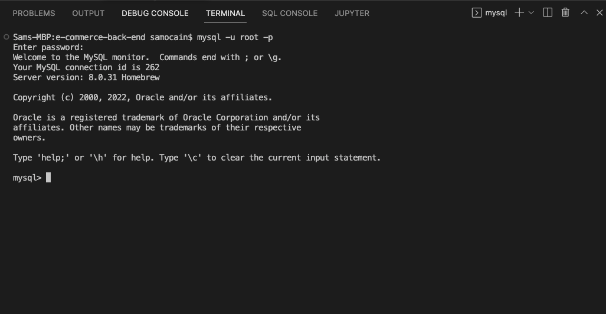

2. After we connect, we want to use the proper database. We'll do this by entering the command `USE ecommerce_db`.

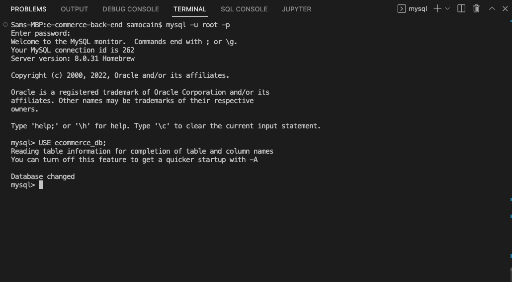

3. When I enter `SHOW tables;`, I can see that the tables are reflected in the database that we're using. 

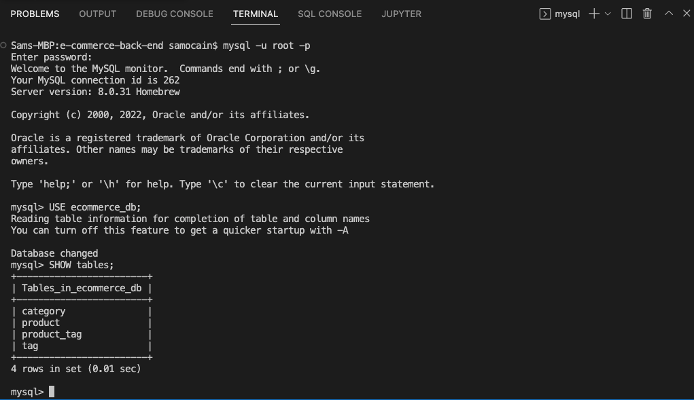

4. Next, we need to seed the information from our seed files into our database. To do this, enter `npm run seed` in your terminal and you should see the following results of the information being entered.

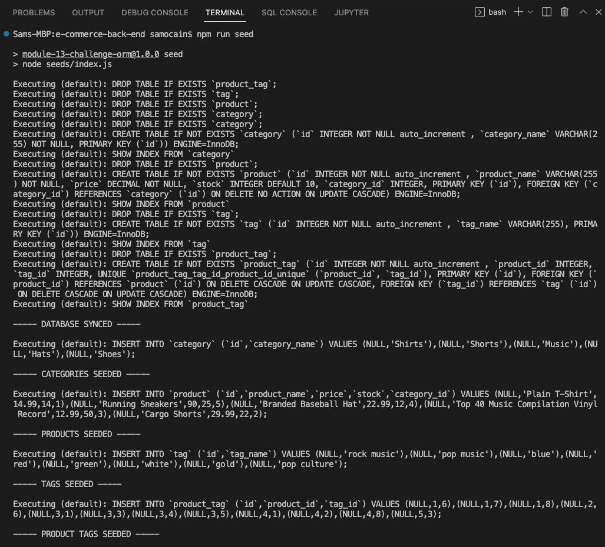

5. Lastly, we need to start our server. We are using Nodemon, which will start and monitor our server for changes. To start, type `npm run watch` in the terminal and the server will begin.

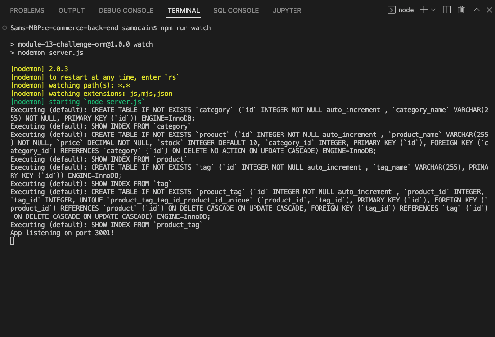


* We will also be using Insomnia to test our routes to show that we can perform all CRUD (Create, Read, Update, Delete) operations successfully, as demonstrated below (examples of all routes and functionality will be shown in the walkthrough demo)
 
 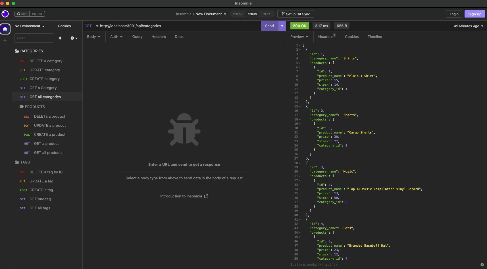

 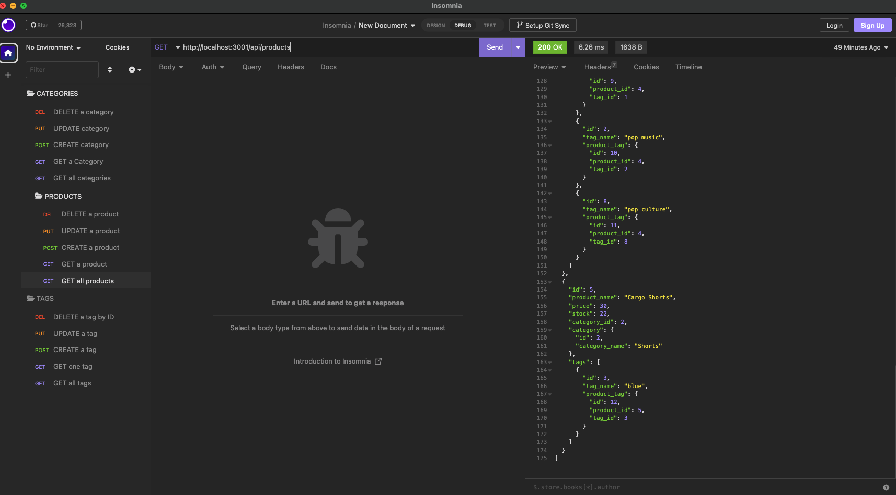

 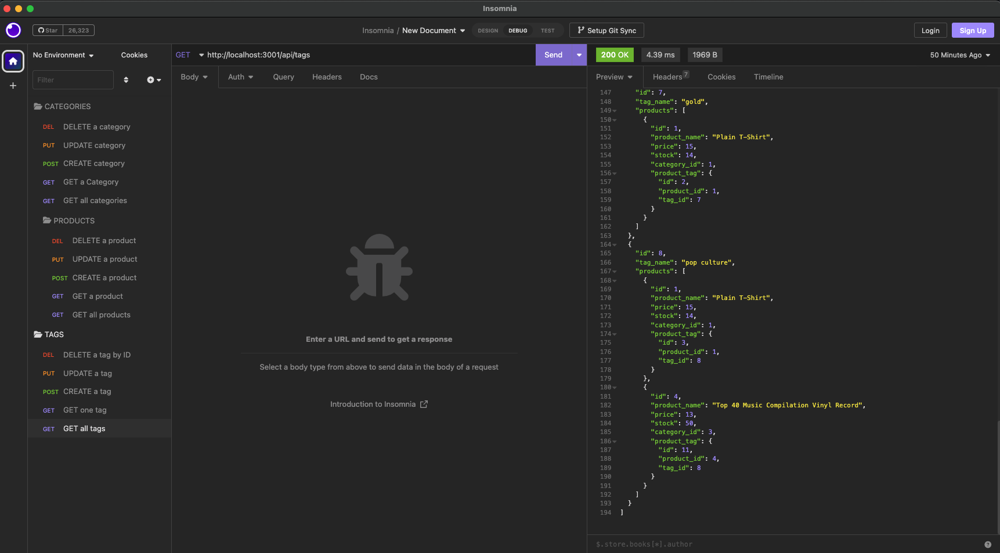

 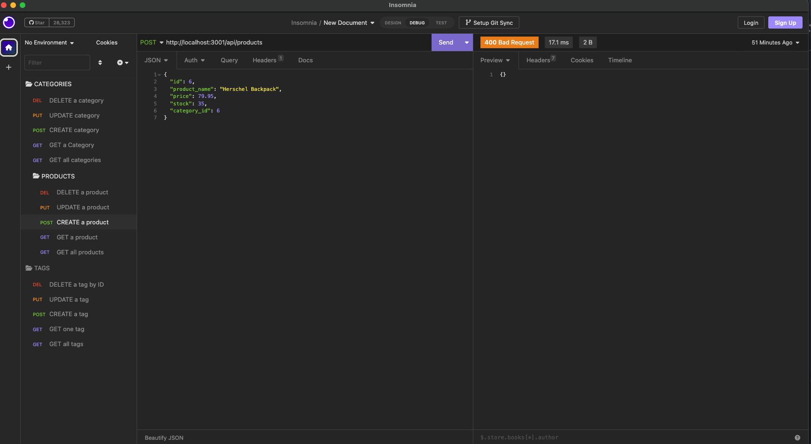

 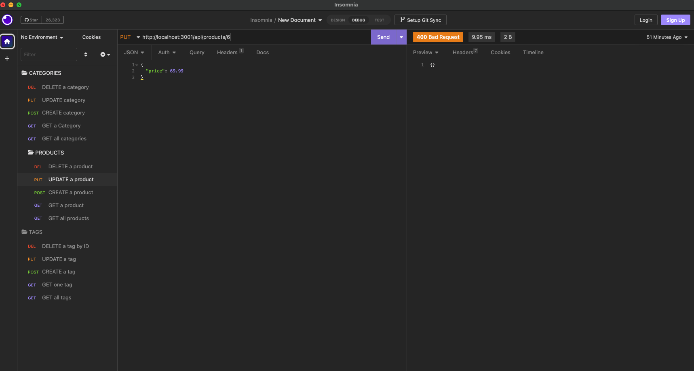

 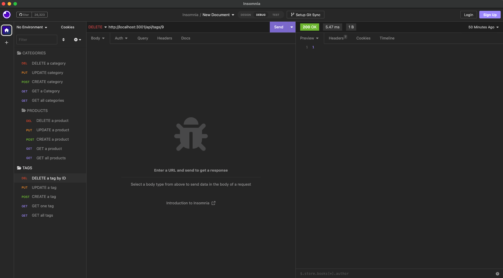


## Walkthrough  

- Demo Walkthrough Video
     * PLEASE NOTE: The DELETE functions are all shown at the end of the walkthrough video as not to interfere with the data being entered. 
     * Video Walkthrough Link: [Watch Here](https://drive.google.com/file/d/1T1E9QiPXgMbVGcx6talhAMK0mAVf3IAs/view)


## License

- This application is available to test and try locally. For any suggestions on improvements or new features, please see the links provided in the following section, or feel free to create a fork for this repo and submit a pull request.
- Sam O'Cain, 2023


## Questions

Email: [samocain93@gmail.com](mailto:samocain93@gmail.com)  

GitHub: [samocain93](https://github.com/samocain93)  

## Socials

[](https://www.linkedin.com/in/samocain/)